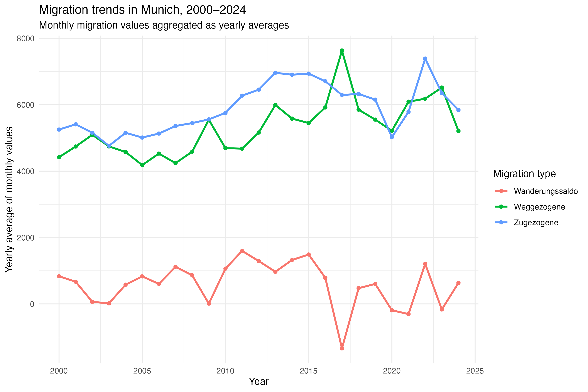
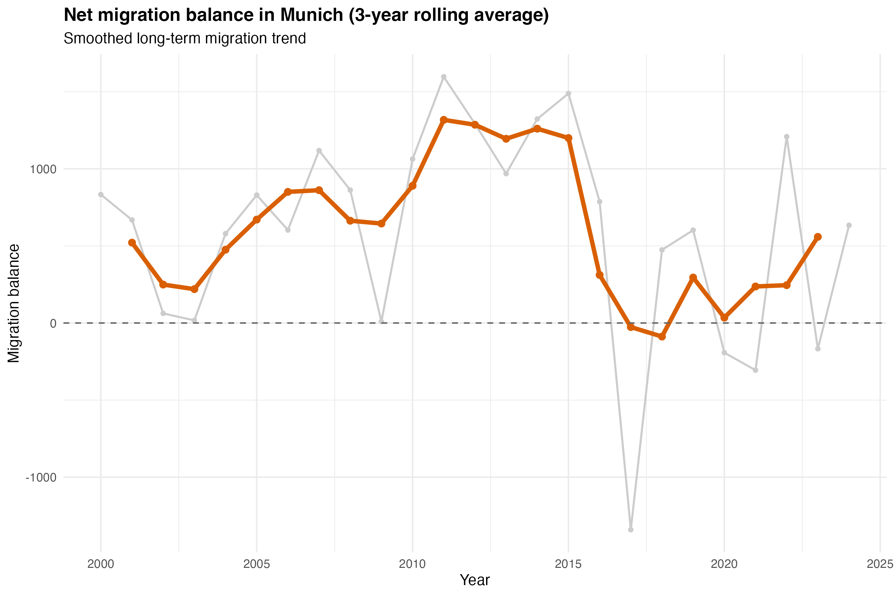
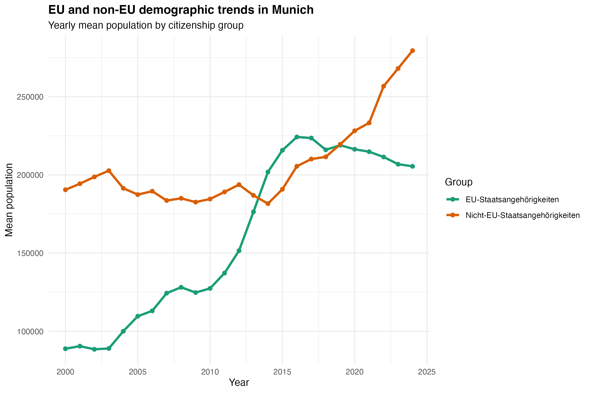
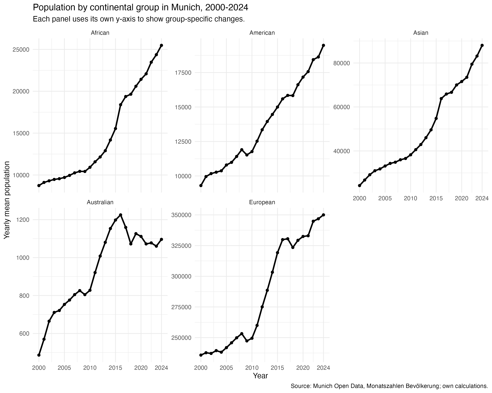
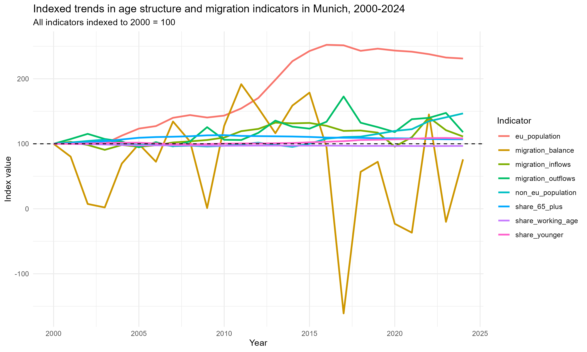
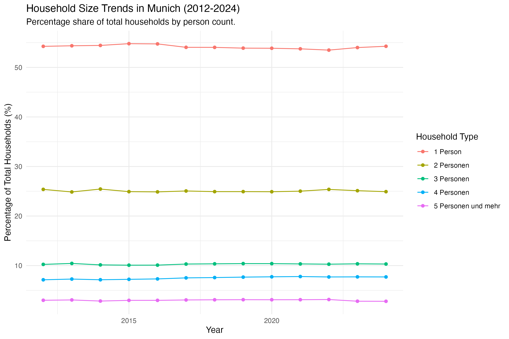
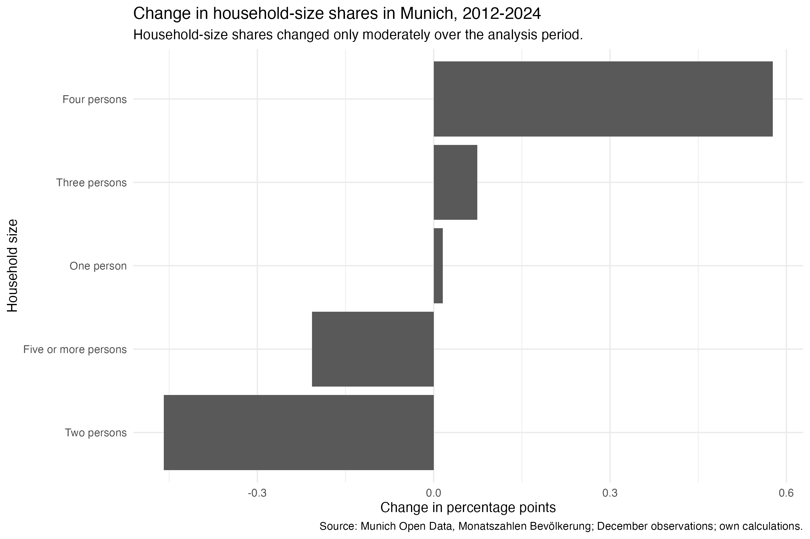
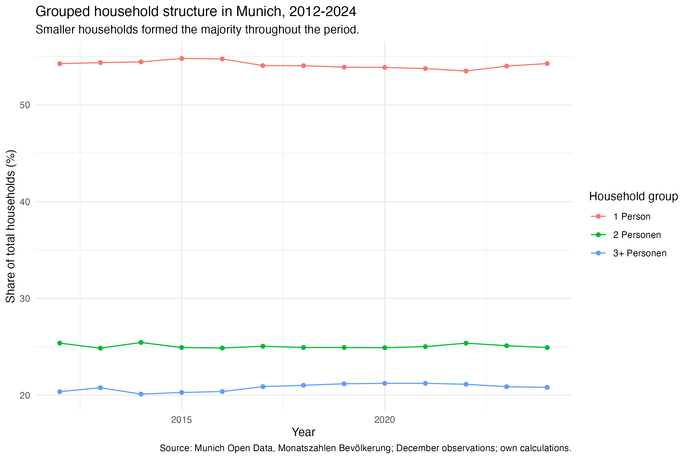

```{r}
library(tidyverse)
library(lubridate)
library(scales)
library(knitr)
```

# Dataset and Research Questions

## Dataset Description

This project uses the dataset *Monatszahlen Bevoelkerung* from the Open Data Portal of the City of Munich. The dataset is provided by the Statistical Office of Munich and contains monthly population-related indicators. The full dataset covers several demographic topics, including gender and nationality, age groups, EU and non-EU nationalities, continents, births, deaths, migration, household structures and other population-related categories.

The dataset is available as a CSV file and is published under the licence **Datenlizenz Deutschland Namensnennung 2.0**.

For this project, we focus on several demographic dimensions of population change in Munich, including age structure, migration dynamics and household composition.

The raw dataset is organised in long format. Each row represents one observation for a specific demographic category, year and month. The most relevant variables are:

| Variable | Description |
|------------------------------------|------------------------------------|
| `MONATSZAHL` | Main demographic topic, for example `Altersgruppen` |
| `AUSPRAEGUNG` | Subcategory within the topic, for example a specific age group |
| `JAHR` | Year of the observation |
| `MONAT` | Month of the observation, usually in `YYYYMM` format |
| `WERT` | Population value for the respective category and month |
| `VORJAHRESWERT` | Value in the same month of the previous year |
| `VERAEND_VORMONAT_PROZENT` | Percentage change compared with the previous month |
| `VERAEND_VORJAHRESMONAT_PROZENT` | Percentage change compared with the same month of the previous year |
| `ZWOELF_MONATE_MITTELWERT` | Twelve-month moving average |

### Age Structure

```{r}
age_data <- read_csv("data/processed/age_data.csv")
age_structure_long <- read_csv("data/processed/age_structure_long.csv")
age_structure_share <- read_csv("data/processed/age_structure_share.csv")
age_change_table <- read_csv("data/processed/age_change_table.csv")

glimpse(age_data)
```

The age-group data contain monthly observations from 2000 to 2025. However, the main analysis is restricted to the complete years from 2000 to 2024. The year 2025 is excluded from the main analysis because the available observations for 2025 are incomplete.

For the analysis, we construct five non-overlapping age groups:

-   0-5 years
-   6-14 years
-   15-17 years
-   18-64 years
-   65 years and older

The original dataset provides the working-age population as `Erwerbsfaehige (15 bis 64 Jahre)`. Since this category overlaps with `Berufsschulpflichtige (15 bis 17 Jahre)`, the 18-64 group is derived by subtracting the 15-17 group from the original 15-64 group. This transformation avoids double-counting and allows the project to analyse a consistent age structure.

### Migration Dynamics

```{r}
population_data <- read_csv(
  "data/processed/population_data.csv"
)

migration_data <- population_data %>%
  filter(
    MONATSZAHL %in% c(
      "Zugezogene",
      "Weggezogene",
      "Wanderungssaldo"
    )
  )

migration_yearly <- migration_data %>%
  filter(year >= 2000, year <= 2024) %>%
  group_by(MONATSZAHL, year) %>%
  summarise(
    mean_value = mean(WERT, na.rm = TRUE),
    .groups = "drop"
  )

glimpse(migration_yearly)
```

The migration-related analysis uses the processed population dataset created during the preprocessing stage. The analysis focuses on the categories `Zugezogene`, `Weggezogene` and `Wanderungssaldo` in order to investigate long-term migration dynamics in Munich.

Monthly observations are aggregated into yearly mean values to simplify long-term trend analysis and reduce short-term fluctuations in the data. The analysis is restricted to the complete years from 2000 to 2024. The year 2025 is excluded because the available observations are incomplete.

In addition to overall migration trends, the project also compares demographic developments between EU and non-EU population groups as well as different continental population groups. These comparisons are used to explore broader processes of demographic internationalisation in Munich.

To highlight longer-term migration developments, a 3-year rolling average is calculated for the migration balance series. This smoothing approach helps reduce short-term yearly fluctuations and makes long-term migration trends easier to interpret.

### Household Structure

```{r}
household_base_filtered <- read_csv("data/processed/household_base_filtered.csv")
household_size_baseline <- read_csv("data/processed/household_size_baseline.csv")
household_grouped <- read_csv("data/processed/household_grouped.csv")
household_grouped_percentage <- read_csv("data/processed/household_grouped_percentage.csv")
glimpse(household_base_filtered)
```

The household analysis focuses on the years 2012 to 2024, because this is the consistent period available for household-size categories in the project dataset. The year 2025 is excluded from the main analysis because the available observations for 2025 are incomplete. To avoid counting several monthly observations for the same year, the analysis uses December observations as an annual baseline.

For the first part of the analysis, five household-size categories are used:

-   1 Person
-   2 Personen
-   3 Personen
-   4 Personen
-   5 Personen und mehr

The dataset `household_base_filtered` contains the absolute number of households by year and household size. From this dataset, we calculate the percentage share of each household type. The resulting table is stored as `household_size_baseline`.

For a simpler comparison, we also group the household types into three categories: `1 Person`, `2 Personen` and `3+ Personen`. This helps us examine whether the household structure in Munich is shifting toward smaller households. The grouped count data are stored in `household_grouped`, and the grouped percentage data are stored in `household_grouped_percentage`.

## Research Questions

The project investigates the following research questions:

### Age Structure

This project investigates changes in the age structure of Munich's population between 2000 and 2024. The analysis focuses on age-group-specific population trends and asks whether the available data provide preliminary evidence of demographic ageing in Munich.

The main research question is:

**How has the age structure of Munich's population changed between 2000 and 2024?**

This main question is addressed through two sub-questions:

1.  **Which age groups have experienced the strongest population growth or decline over time?**

2.  **Is there preliminary evidence of demographic ageing in Munich?**

The first sub-question focuses on absolute and relative population changes across age groups. The second sub-question is treated cautiously: an increase in the 65+ group may indicate demographic ageing, but this needs to be assessed together with the development of younger age groups and the relative age-group shares.

### Migration Dynamics

Main question

1.  **How have migration-related demographic trends changed over time in Munich?**

This main question is addressed through two sub-questions:

1.  **Are there observable differences between EU and non-EU demographic trends?**

2.  **How do demographic developments differ across continental population groups in Munich?**

### Household Structure

The main research question is:

**How has the household structure in Munich changed between 2012 and 2024?**

This main question is addressed through two sub-questions:

1.  **Which household types have changed the most in their relative share over time?**

2.  **Is there preliminary evidence of a shift toward smaller households in Munich?**

The first sub-question compares the percentage shares of different household types between 2012 and 2024. The second sub-question uses the grouped categories `1 Person`, `2 Personen` and `3+ Personen` to examine whether smaller households have become more important in Munich's household structure.

## Context and Target Audience

Munich has experienced substantial demographic transformation over the past decades. Population growth, migration, demographic ageing and changing household structures are all relevant for several areas of urban planning, including housing, childcare, schools, healthcare, public transport and social services.

The target audience of this analysis includes local policymakers, urban planners, researchers and citizens interested in demographic change in Munich.

The project is primarily descriptive and exploratory. Rather than explaining the causal mechanisms behind demographic change, the project aims to investigate how different demographic dimensions — including age structure, migration dynamics and household composition — developed over time between 2000 and 2024.

Particular attention is given to long-term demographic restructuring and processes of urban internationalisation in Munich.

# Initial Data Analysis

## Data Structure

### Age Structure

The initial data analysis uses the cleaned age-group dataset. The dataset contains monthly observations for different age groups from 2000 to 2025. Since 2025 is incomplete, the main analysis focuses on the complete years 2000-2024.

```{r}
glimpse(age_data)
```

The following summary shows the number of observations, missing values and time range for each original age group.

```{r}
age_data %>%
  group_by(AUSPRAEGUNG) %>%
  summarise(
    n_rows = n(),
    missing_values = sum(is.na(WERT)),
    min_year = min(year, na.rm = TRUE),
    max_year = max(year, na.rm = TRUE),
    .groups = "drop"
  ) %>%
  arrange(AUSPRAEGUNG) %>%
  kable()
```

The original age categories are partly overlapping. For example, `Minderjaehrige (0 bis 17 Jahre)` includes the younger age groups 0-5, 6-14 and 15-17. Therefore, the analysis does not simply add all original age groups together. Instead, it constructs five non-overlapping groups: 0-5, 6-14, 15-17, 18-64 and 65+.

#### Distribution of Age Structure in Selected Years

The following plot compares the constructed age structure in selected years. This provides an initial view of how the relative composition of Munich's population changed in 2000, 2010, 2020 and 2024.

```{r}
#| label: fig-age-structure-selected-years
#| fig-cap: "Age structure of Munich's population in selected years (2000, 2010, 2020, 2024)"

age_structure_bar_plot <- ggplot(
  age_structure_share %>%
    filter(year %in% c(2000, 2010, 2020, 2024)),
  aes(
    x = factor(year),
    y = population_share,
    fill = age_group
  )
) +
  geom_col() +
  scale_y_continuous(labels = percent) +
  labs(
    title = "Age structure of Munich's population in selected years",
    subtitle = "Comparison of age group shares in 2000, 2010, 2020 and 2024",
    x = "Year",
    y = "Share of population",
    fill = "Age group"
  ) +
  theme_minimal()

age_structure_bar_plot
```

The plot shows that the 18-64 group remained the dominant age group throughout the period. However, the relative composition changed slightly over time. The 65+ group became more important, while younger age groups also increased in relative and absolute terms.

#### Population Trends by Age Group

The following plot shows the yearly mean population for each age group from 2000 to 2024. Each panel has its own y-axis, which makes it easier to inspect smaller age groups separately.

```{r}
#| label: fig-age-trends-faceted
#| fig-cap: "Population trends by age group in Munich, 2000-2024."

age_trend_facet_plot <- ggplot(
  age_structure_long,
  aes(
    x = year,
    y = population
  )
) +
  geom_line(linewidth = 1) +
  geom_point(size = 1.5) +
  facet_wrap(
    ~ age_group,
    scales = "free_y"
  ) +
  scale_y_continuous(labels = scales::comma) +
  labs(
    title = "Population trends by age group in Munich, 2000-2024",
    subtitle = "Yearly mean population, shown with separate y-axes for each age group",
    x = "Year",
    y = "Mean population"
  ) +
  theme_minimal()

age_trend_facet_plot
```

The faceted trend plot indicates that all selected age groups increased between 2000 and 2024. The 18-64 group experienced the largest absolute increase, while school-age children and adolescents show particularly strong relative growth.

#### Change Between 2000 and 2024

The following table compares the yearly mean population of each age group in 2000 and 2024.

```{r}
age_change_table %>%
  mutate(
    across(
      c(`2000`, `2024`, absolute_change),
      ~ round(.x, digits = 0)
    ),
    relative_change = round(relative_change, digits = 1)
  ) %>%
  rename(
    `Age group` = age_group,
    `Population 2000` = `2000`,
    `Population 2024` = `2024`,
    `Absolute change` = absolute_change,
    `Relative change (%)` = relative_change
  ) %>%
  kable()
```

The table shows that the 18-64 group had the largest absolute increase, growing by more than 212,000 people between 2000 and 2024. In relative terms, however, the strongest growth occurred among school-age children aged 6-14 and adolescents aged 15-17, both increasing by around 41%. The 65+ group also grew substantially, by about 38%, which provides preliminary evidence of demographic ageing. However, because younger age groups also increased strongly, Munich's demographic change cannot be described as ageing alone.

#### Data Quality Issues

Several data quality issues need to be considered. First, the year 2025 is incomplete and is therefore excluded from the main trend analysis. Second, each selected age group contains several missing monthly values. These missing values are handled by calculating yearly means with `na.rm = TRUE`. Third, the original age categories overlap, so derived non-overlapping age groups are required to avoid double-counting. Finally, evidence of demographic ageing should not be based only on absolute population counts; relative shares and ratios are also needed for a more careful interpretation.

### Migration Dynamics

#### Migration Data Structure

```{r}
glimpse(population_data)
```

#### Migration Variable Selection

```{r}
migration_overview <- population_data %>%
  filter(
    MONATSZAHL %in% c(
      "Zugezogene",
      "Weggezogene",
      "Wanderungssaldo"
    )
  )
```

The migration analysis investigates demographic change from three complementary perspectives.\
\
First, overall migration dynamics are analysed using migration inflows (\`Zugezogene\`), migration outflows (\`Weggezogene\`) and net migration balance (\`Wanderungssaldo\`). These indicators provide information about long-term migration developments in Munich.\
\
Second, processes of internationalisation are explored through comparisons between EU and non-EU population groups.\
\
Third, demographic diversification is examined through continental population groups (\`Kontinente\`), allowing the project to investigate differences in population development across broader geographical regions.

#### Migration Trends

The following figure compares migration inflows (`Zugezogene`), migration outflows (`Weggezogene`) and net migration balance (`Wanderungssaldo`) between 2000 and 2024.

The plot shows that both migration inflows and outflows increased considerably over time. Although the two series generally follow similar patterns, migration inflows exceeded migration outflows during many years, resulting in a positive migration balance. However, the migration balance appears to weaken after the mid-2010s, indicating slower net migration growth.

These trends suggest that migration has been an important contributor to Munich's population growth during the observation period.

```{r}
#| label: fig-migration-trends
#| fig-cap: "Yearly averages of monthly migration inflows, outflows and migration balance in Munich, 2000-2024."


```

#### Migration Balance

The migration balance provides a more direct measure of whether Munich gained or lost population through migration.

To highlight longer-term migration dynamics and reduce short-term fluctuations, a 3-year rolling average was calculated for the migration balance series.

The rolling-average trend indicates that Munich experienced sustained positive net migration during much of the 2000s and early 2010s. However, migration gains appear to decline after approximately 2015, followed by a period of greater fluctuation.

While Munich generally remained a net recipient of migrants, the results suggest that migration-driven population growth became less pronounced in recent years.

```{r}
#| label: fig-migration-balance
#| fig-cap: "Yearly average monthly net migration balance in Munich, 2000-2024, with a 3-year rolling average."


```

#### EU vs Non-EU Comparison

The migration analysis also examines broader processes of internationalisation through comparisons between EU and non-EU population groups.

```{r}
population_data %>%
  filter(MONATSZAHL == "EU-Staatsangehörigkeiten")

population_data %>%
  filter(MONATSZAHL == "Nicht-EU-Staatsangehörigkeiten")
```

```{r}
#| label: fig-eu-non-eu
#| fig-cap: "EU and non-EU demographic trends in Munich, 2000-2024."


```

The figure shows that both EU and non-EU populations increased substantially between 2000 and 2024. However, the growth patterns differ considerably.

The EU population experienced rapid growth between approximately 2010 and 2016, reaching a peak of more than 220,000 residents before declining slightly in recent years. In contrast, the non-EU population remained relatively stable during the early 2000s but increased strongly after the mid-2010s.

The EU population temporarily exceeded the non-EU population between 2014 and 2018. From around 2019 onward, the non-EU population became larger again and continued to grow throughout the remainder of the observation period. By 2024, non-EU populations represented the larger of the two groups.

These results suggest that non-EU populations have become an increasingly important component of Munich's demographic internationalisation in recent years.

#### Continental Group Comparison

In addition to the EU and non-EU comparison, the project investigates demographic developments across continental population groups.

```{r}
population_data %>%
  filter(MONATSZAHL == "Kontinente")
```

The faceted trend plot reveals substantial differences in demographic developments across continental population groups between 2000 and 2024.

European populations remained the largest continental group throughout the observation period, increasing from approximately 236,000 to more than 350,000 residents. Growth accelerated particularly after 2010.

Asian populations experienced the strongest relative increase among the larger continental groups. The population more than tripled during the observation period, rising from around 25,000 in 2000 to nearly 90,000 in 2024. A particularly strong increase can be observed after 2015.

African and American populations also grew steadily over time. American populations approximately doubled, while African populations nearly tripled between 2000 and 2024. Although their absolute population levels remained substantially lower than those of European and Asian populations.

In contrast, the Australian population remained comparatively small and showed only moderate growth, followed by a relatively stable development after the mid-2010s.

Overall, the results suggest that Munich's demographic change has been characterised not only by population growth but also by increasing international diversification. While European populations continue to dominate numerically, Asian, African and American populations have grown considerably faster, indicating a broadening geographical composition of Munich's population.

```{r}
#| label: fig-continental-groups
#| fig-cap: "Population trends by continental groups in Munich, 2000-2024."


```

#### Data Quality Issues

Several issues should be considered when interpreting the migration analysis. First, the year 2025 is incomplete and is therefore excluded from the main analysis. Second, monthly observations are aggregated into yearly mean values, which may conceal short-term migration fluctuations. Third, the EU/non-EU and continental comparisons are descriptive and do not allow causal conclusions about migration processes. Finally, migration trends should not be interpreted based solely on absolute population counts; relative population shares and growth rates may provide additional insights into Munich's demographic transformation.

### Age-Migration Exploratory Comparison

To connect the age structure analysis with the migration dynamics analysis, this section compares selected age and migration indicators at the yearly level from 2000 to 2024. The combined table includes age-group shares, migration inflows, migration outflows, migration balance, and EU and non-EU population indicators.

Because these indicators have different units, they are indexed to 2000 = 100. This makes it possible to compare long-term relative changes across indicators.

```{r}
#| label: fig-age-migration-indexed
#| fig-cap: "Indexed trends in selected age-structure and migration indicators in Munich, 2000-2024. All indicators are indexed to 2000 = 100."


```

The indexed comparison provides a descriptive overview of how age-structure indicators and migration-related indicators developed over the same period. It can show whether selected indicators moved in similar or different directions over time. However, this comparison is exploratory only and does not provide evidence of causal relationships. Similar trends may reflect shared long-term demographic developments rather than a direct effect of migration on age structure.

### Household Structure

#### Household Data Structure

```{r}
glimpse(household_base_filtered)
```

The household analysis uses the category `Haushalte nach Personenzahl` from the Munich Open Data population dataset. The analysis focuses on 2012 to 2024, because this is the consistent period available for household-size categories.

To avoid counting several monthly observations for the same year, December observations are used as an annual baseline. This is appropriate because household-size categories describe the number of households at a specific point in time rather than monthly flow data.

The analysis includes five household-size categories:

- `1 Person`
- `2 Personen`
- `3 Personen`
- `4 Personen`
- `5 Personen und mehr`

The dataset `household_base_filtered` contains the number of households by year and household size. From this dataset, the percentage share of each household type is calculated and stored as `household_size_baseline`.


#### Household Size Trends

The following figure shows how the percentage share of different household-size categories changed between 2012 and 2024.

```{r}
#| label: fig-household-size-share-trend
#| fig-cap: "Percentage share of household-size categories in Munich, 2012-2024."


```

The plot provides an initial overview of Munich's household structure over time. It shows that one-person households remained the largest household category throughout the period, while the relative shares of the other household-size categories changed only moderately. The percentage view is useful because it separates changes in household composition from the overall increase in the number of households.


#### Change Between 2012 and 2024

The following figure compares the percentage point change of each household-size category between 2012 and 2024.

```{r}
#| label: fig-household-share-change
#| fig-cap: "Percentage point change in household-size shares between 2012 and 2024."


```

This comparison helps identify which household types experienced the strongest relative increase or decrease over time. Instead of only looking at absolute household numbers, the analysis focuses on percentage shares, because the total number of households also changed during the period.

#### Grouped Household Structure

For a simpler comparison, the household types are also grouped into three broader categories: `1 Person`, `2 Personen` and `3+ Personen`. This makes it easier to examine whether Munich's household structure is shifting toward smaller households.

```{r}
#| label: fig-household-grouped-share-trend
#| fig-cap: "Percentage share of one-person, two-person, and three-or-more-person households in Munich, 2012-2024."


```

The grouped household structure shows that one-person households were the largest household group throughout the period, followed by two-person households and households with three or more persons. Together, one-person and two-person households made up the majority of households in Munich.

However, the relative shares changed only moderately between 2012 and 2024. Therefore, the figure does not show a strong structural shift toward smaller households during this period. Rather, it suggests that Munich already had a household structure strongly shaped by smaller households, especially one-person households.

#### Data Quality Issues

Several issues need to be considered when interpreting the household analysis. First, the household-size analysis is restricted to the years 2012 to 2024, because this is the consistent period available for this part of the project. Second, the analysis uses December observations as an annual baseline, so short-term monthly changes are not examined. Third, the data are aggregated municipal statistics. Therefore, the analysis cannot explain individual living situations or causal mechanisms behind changes in household structure.

In addition, the relative household shares changed only moderately during the observation period. Therefore, the question of a shift toward smaller households should be interpreted cautiously. The analysis can show whether smaller households were dominant or changed in relative importance, but it cannot by itself explain why this pattern occurred.

# Analysis Plan

## Age Structure Analysis

The final analysis will remain descriptive and exploratory. The aim is not to identify causal mechanisms behind Munich's demographic development, but to describe how the city's age structure changed over time and whether the available data suggest preliminary evidence of demographic ageing.

The analysis will use the following variables:

| Variable | Role in the analysis |
|------------------------------------|------------------------------------|
| `year` | Time variable for yearly trend analysis |
| `month` | Month variable, mainly used for data cleaning and possible seasonal checks |
| `AUSPRAEGUNG` | Original age-group category |
| `WERT` | Monthly population value |
| `age_group` | Constructed non-overlapping age-group category |
| `population` | Yearly mean population by constructed age group |
| `population_share` | Relative share of each age group within the constructed age structure |

The main analysis will proceed in four steps.

First, the raw data will be cleaned by removing annual summary rows where `MONAT == "Summe"` and by converting the monthly variable into a proper date format. The analysis will then be restricted to the topic `Altersgruppen`, because the project focuses on age structure.

Second, the original age-group categories will be reorganised into five non-overlapping groups: 0-5, 6-14, 15-17, 18-64 and 65+. Since the original dataset contains `Erwerbsfaehige (15 bis 64 Jahre)` but not a direct 18-64 category, the 18-64 group will be derived by subtracting the 15-17 group from the 15-64 group. This step is necessary to avoid double-counting across overlapping age categories.

Third, yearly mean population values will be calculated for each constructed age group. These values will be used to visualise long-term trends and to calculate absolute and relative population changes between 2000 and 2024.

Fourth, the analysis will compare both absolute population changes and relative age-group shares. Absolute changes help identify which groups contributed most to the numerical population increase, while relative shares are needed to assess whether Munich's population structure shifted toward older age groups.

The main indicators will be:

-   absolute population change between 2000 and 2024;
-   relative population change in percent;
-   yearly age-group trends;
-   age-group shares in selected years;
-   development of the 65+ group relative to younger and working-age groups.

Several limitations need to be considered. The year 2025 is not included in the main analysis because it is incomplete. Some monthly observations are missing, especially around 2018 and in the incomplete 2025 data. These missing values are handled by calculating yearly means with `na.rm = TRUE`, but the missingness should still be mentioned as a limitation. In addition, demographic ageing should not be inferred only from absolute growth of the 65+ group. A careful interpretation requires comparing the 65+ group with the total population and with other age groups.

## Migration Analysis

The final report will extend the exploratory analysis in three ways.

First, migration-related population groups will be analysed not only in terms of absolute population counts but also through relative population shares and growth rates. This will allow a more detailed assessment of demographic internationalisation in Munich.

Second, the report will compare long-term developments across EU and non-EU populations as well as continental population groups in order to identify differences in demographic growth patterns.

Third, migration trends will be interpreted together with the project's findings on age structure and household composition. The aim is to explore whether increasing internationalisation, population ageing and changing household structures can be understood as interconnected dimensions of Munich's broader demographic restructuring.

## Household Structure Analysis

The household analysis is structured around three outputs.

First, the percentage share of five household-size categories is visualised from 2012 to 2024.

Second, the percentage point change between 2012 and 2024 is calculated to identify which household types changed most.

Third, household types are grouped into `1 Person`, `2 Personen` and `3+ Personen` to assess whether there is evidence of a shift toward smaller households.

# Workflow Organisation

The project is organised as a reproducible Quarto and GitHub-based workflow. The repository separates raw data, processed data, analysis scripts, figures and written output.

## Repository Structure

The project repository follows this structure:

``` text
project-name/
|-- README.md
|-- _quarto.yml
|-- data/
|   |-- raw/
|   `-- processed/
|-- code/
|   |-- 01_import_clean.R
|   |-- 02_eda.R
|   `-- 03_analysis.R
|-- docs/
|   `-- figures/
|-- proposal.qmd
|-- report.qmd
`-- .gitignore
```

The raw dataset is stored in `data/raw/` and is not edited manually. Cleaned and derived datasets are saved in `data/processed/`. The R scripts in `code/` document the data cleaning and exploratory analysis steps. Figures created by the scripts are saved in `figures/`, while the rendered website is written to `docs/`.

## Code Style

The project uses a tidyverse-oriented coding style. Object names are written in lower case with underscores, for example `age_data`, `age_structure_long` and `age_change_table`. Scripts are numbered according to their role in the workflow, so that the order of execution is clear.

The code is structured into separate steps:

1.  importing and cleaning the raw data;
2.  filtering and restructuring the age-group data;
3.  calculating yearly means and derived age groups;
4.  creating exploratory visualisations and summary tables.

We aim to keep the code readable by using clear object names, short comments and consistent indentation.

## Packages

The project currently uses the following R packages:

| Package     | Purpose                                            |
|-------------|----------------------------------------------------|
| `tidyverse` | Data import, cleaning, transformation and plotting |
| `lubridate` | Date conversion and extraction of year and month   |
| `scales`    | Formatting percentages and large numbers in plots  |
| `knitr`     | Rendering tables in the Quarto document            |
| `quarto`    | Rendering the proposal as an HTML webpage          |

If the analysis becomes more complex later, additional packages may be added. Package use will be documented in the scripts and in the Quarto document.

## Reproducibility

The workflow is designed so that the analysis can be reproduced from the raw data. The raw CSV file is read from `data/raw/`, cleaned in `code/01_import_clean.R`, and then saved as processed CSV files in `data/processed/`. The proposal reads these processed files directly.

At the current proposal stage, `renv` is not yet used. If package version control becomes necessary later in the project, we plan to initialise `renv` to make the computational environment more reproducible.

## Git Workflow

Git is used to track changes to code, data-processing scripts and the Quarto proposal. The main branch should contain stable versions of the project. Larger changes should be developed in separate branches, for example:

-   `clean-age-data`
-   `eda-age-structure`
-   `write-proposal`
-   `update-figures`

Commit messages should describe the change clearly, for example:

``` text
Add age group cleaning script
Create faceted age trend plot
Update initial data analysis section
```

Before pushing changes, the Quarto document should be rendered locally to check whether the proposal still works.

## Files Ignored by Git

The `.gitignore` file should exclude temporary or local files that are not needed for reproducibility, for example:

``` text
.Rhistory
.RData
.Rproj.user/
.DS_Store
*.html
*.log
```

Large raw files or sensitive files such as API keys should also be excluded if they are added later. Since this project currently uses a public CSV dataset, there are no confidential data files.
