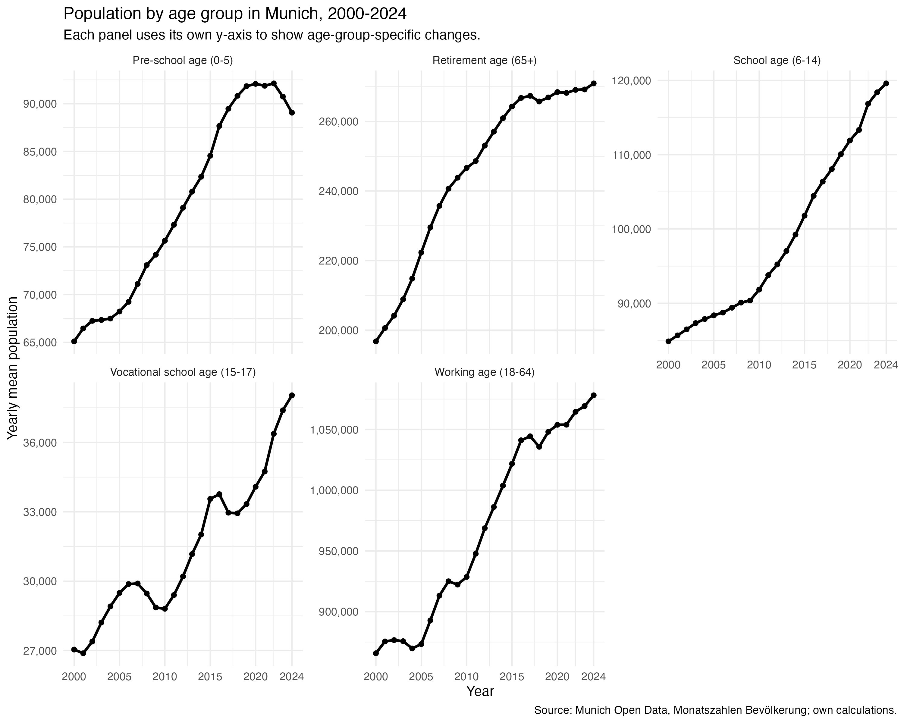
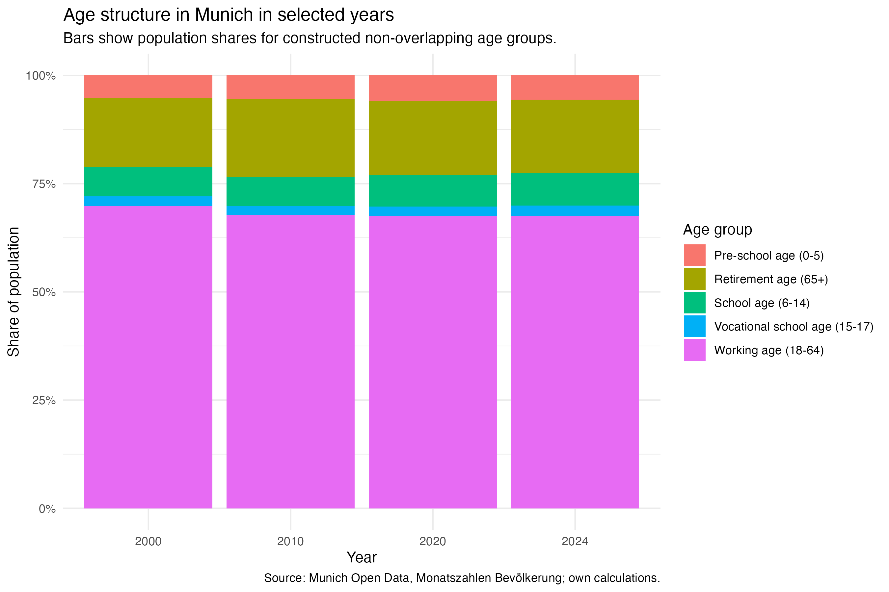

```{r}
library(tidyverse)
library(gt)
library(scales)
library(knitr)

age_change_table <- read_csv("data/processed/age_change_table.csv")
migration_change_table <- read_csv("data/processed/migration_change_table.csv")
migration_extreme_years <- read_csv("data/processed/migration_extreme_years.csv")
eu_non_eu_change_table <- read_csv("data/processed/eu_non_eu_change_table.csv")
household_share_change_table <- read_csv("data/processed/household_share_change_table.csv")
```

# Executive Summary

Munich’s demographic transformation between 2000 and 2024 is characterized by modest age-structure change, volatile migration flows, strong international diversification, and stable household composition.

-   **Ageing is visible but limited.** The 65+ population increased in absolute terms, but its population share rose only slightly, from about 15.9% to 17.0%. Younger age groups also grew, so Munich cannot be described as simply getting older.

-   **Migration is better understood as a volatile short-term indicator than as a smooth long-term trend.** Net migration balance was about 833 in 2000 and 634 in 2024, but it fluctuated strongly between those years, reaching a high around 1,597 in 2011 and a low around -1,340 in 2017.

-   **International diversification is one of the clearest structural changes.** EU and non-EU populations both increased strongly, while Asian and African population groups grew especially fast. This suggests that Munich's demographic transformation is not only about population growth, but also about changing international composition.

-   **Household composition remained surprisingly stable.** One-person households stayed at around 54.3% between 2012 and 2024. This stability provides an important contrast to the stronger changes observed in migration and international composition.

# Research Questions

This report asks how Munich's demographic structure changed between 2000 and 2024.

More specifically, we focus on three descriptive questions:

1.  How did Munich's age structure change during this period?
2.  How did migration dynamics and international population composition change?
3.  Did household-size composition change alongside Munich's age structure and migration dynamics, or did it remain relatively stable?

The analysis is descriptive and exploratory. It does not aim to identify causal effects.

# Data and Scope

This project uses the dataset *Monatszahlen Bevölkerung* from the Open Data Portal of the City of Munich. Each row represents one demographic topic, subcategory and month.

The main value column, `WERT`, contains the reported population count or migration value for a specific demographic category and month. For population-stock variables such as age groups, EU/non-EU citizenship groups and household structure, the values describe the size of a group at a given time. For migration indicators, the values describe monthly inflows, outflows or net migration balance.

Rows where `MONAT == "Summe"` were excluded from analyses based on monthly observations because they are annual summary rows, not monthly observations. The main analysis excludes 2025 because it is incomplete.

For age structure and migration, the report focuses on 2000-2024. For household structure, it focuses on 2012-2024 because this is the consistent period available for household-size categories.

Because the dataset is monthly, the yearly migration values in this report are calculated as yearly averages of monthly observations. They should therefore not be interpreted as annual totals.

# Report Storyline

The report follows four connected findings. Age structure changed gradually, with only limited evidence of ageing and growth among younger groups. Migration indicators fluctuated strongly and therefore reflect short-term demographic volatility. International composition changed more visibly, especially through the growth of non-EU, Asian and African population groups. In contrast, household composition remained surprisingly stable, with one-person households continuing to dominate throughout 2012-2024.

# Munich Grew Across Age Groups, But Not Evenly

The age analysis compares five non-overlapping age groups. The 18-64 group had the largest absolute increase, while younger school-age groups and the 65+ group showed stronger relative growth.

```{r}

```

The age-share comparison gives a more direct view of demographic ageing. The 65+ share increased from about 15.9% in 2000 to about 17.0% in 2024. This suggests a slight shift toward an older age structure, but the change is not large enough to describe Munich's demographic development as ageing alone.

```{r}

```

The table reports start-end comparisons to show the exact magnitude of change between 2000 and 2024.

```{r}
age_change_table %>%
  mutate(
    across(c(`2000`, `2024`, absolute_change), ~ round(.x, 0)),
    relative_change = round(relative_change, 1)
  ) %>%
  gt() %>%
  fmt_number(columns = c(`2000`, `2024`, absolute_change), decimals = 0) %>%
  fmt_number(columns = relative_change, decimals = 1) %>%
  cols_label(
    age_group = "Age group",
    `2000` = "2000",
    `2024` = "2024",
    absolute_change = "Absolute change",
    relative_change = "Relative change (%)"
  ) %>%
  tab_header(
    title = "Age groups changed unevenly between 2000 and 2024",
    subtitle = "Values are yearly mean population counts"
  ) %>%
  tab_source_note("Source: Munich Open Data, Monatszahlen Bevölkerung; own calculations.")
```

# Migration Became More Volatile After the Mid-2010s

Migration indicators are aggregated as yearly averages of monthly observations. Therefore, the values describe average monthly migration levels within each year, not total annual migration flows.

```{r}
#| echo: false
#| out-width: "90%"

knitr::include_graphics("figures/migration_trend_plot.png")
```

```{r}
migration_change_table %>%
  mutate(
    MONATSZAHL = recode(
      MONATSZAHL,
      "Zugezogene" = "Arrivals",
      "Weggezogene" = "Departures",
      "Wanderungssaldo" = "Net migration"
    )
  ) %>%
  gt() %>%
  fmt_number(columns = c(year_2000, year_2024, absolute_change), decimals = 0) %>%
  fmt_number(columns = relative_change_percent, decimals = 1) %>%
  cols_label(
    MONATSZAHL = "Migration indicator",
    year_2000 = "2000",
    year_2024 = "2024",
    absolute_change = "Absolute change",
    relative_change_percent = "Relative change (%)"
  ) %>%
  tab_header(
    title = "Migration indicators changed between 2000 and 2024",
    subtitle = "Yearly averages of monthly observations"
  ) %>%
  tab_source_note("Source: Munich Open Data, Monatszahlen Bevölkerung; own calculations.")
```

# Net Migration Shows Strong Year-to-Year Fluctuation

The rolling average smooths short-term variation and makes the longer-term pattern easier to read.

```{r}
#| echo: false
#| out-width: "90%"

knitr::include_graphics("figures/migration_balance_rolling_plot.png")
```
The rolling average highlights a clear change around the mid-2010s, including the negative net migration balance around 2017 and the later recovery. This supports interpreting migration as a short-term volatile indicator rather than a smooth structural trend.

```{r}
migration_extreme_years %>%
  mutate(
    MONATSZAHL = recode(
      MONATSZAHL,
      "Zugezogene" = "Arrivals",
      "Weggezogene" = "Departures",
      "Wanderungssaldo" = "Net migration"
    )
  ) %>%
  gt() %>%
  fmt_number(columns = c(lowest_value, highest_value), decimals = 0) %>%
  cols_label(
    MONATSZAHL = "Migration indicator",
    lowest_year = "Lowest year",
    lowest_value = "Lowest value",
    highest_year = "Highest year",
    highest_value = "Highest value"
  ) %>%
  tab_header(
    title = "Migration indicators reached their extremes in different years",
    subtitle = "Extremes are based on yearly averages of monthly values"
  ) %>%
  tab_source_note("Source: Munich Open Data, Monatszahlen Bevölkerung; own calculations.")
```

# Internationalisation Increased, Especially Among Non-EU Groups

The EU/non-EU comparison helps describe Munich's demographic internationalisation. This comparison is descriptive and does not identify causal mechanisms.

```{r}
#| echo: false
#| out-width: "90%"

knitr::include_graphics("figures/eu_non_eu_plot.png")
```

```{r}
eu_non_eu_change_table %>%
  mutate(
    MONATSZAHL = recode(
      MONATSZAHL,
      "EU-Staatsangehörigkeiten" = "EU citizens",
      "Nicht-EU-Staatsangehörigkeiten" = "Non-EU citizens"
    )
  ) %>%
  gt() %>%
  fmt_number(columns = c(year_2000, year_2024, absolute_change), decimals = 0) %>%
  fmt_number(columns = relative_change_percent, decimals = 1) %>%
  cols_label(
    MONATSZAHL = "Group",
    year_2000 = "2000",
    year_2024 = "2024",
    absolute_change = "Absolute change",
    relative_change_percent = "Relative change (%)"
  ) %>%
  tab_header(
    title = "Non-EU populations became increasingly important",
    subtitle = "Comparison of yearly mean population values in 2000 and 2024"
  ) %>%
  tab_source_note("Source: Munich Open Data, Monatszahlen Bevölkerung; own calculations.")
```

```{r}
#| echo: false
#| out-width: "100%"

knitr::include_graphics("figures/continent_facet_plot.png")
```
The continental comparison adds detail to the EU/non-EU result. European population groups remain the largest in absolute terms, but Asian and African population groups show stronger relative growth. This suggests that Munich's internationalisation is not only a change in EU/non-EU composition, but also a broader geographical diversification.

# Exploratory Age-Migration Comparison

To compare long-term structural change with short-term migration dynamics, we also use an indexed view of selected age and migration indicators.

```{r}
#| echo: false
#| out-width: "90%"
#| fig-cap: "Indexed comparison of selected age-structure and migration indicators."
#| fig-alt: "Line chart comparing indexed age-structure indicators and migration indicators over time. Age-related indicators change more gradually, while migration indicators fluctuate more strongly."

knitr::include_graphics("figures/age_migration_indexed_plot.png")
```

By placing age-structure and migration indicators on a common indexed scale, this comparison shows that Munich's demographic change was not a single synchronized process. Age-structure indicators changed gradually, while migration indicators fluctuated more strongly. This section is therefore a synthesis of the previous findings, not a causal analysis.

# Smaller Households Remained Dominant

The household analysis provides a contextual comparison to the age and migration results. While age structure, migration dynamics and international composition changed between 2000 and 2024, household-size composition can only be analysed consistently from 2012 onward.

Household sizes are grouped into one-person, two-person and three-or-more-person households because larger household-size categories are smaller and easier to interpret together. The analysis uses December observations from 2012 to 2024 as an annual baseline. This avoids counting several monthly observations for the same year.


```{r}
#| echo: false
#| out-width: "90%"

knitr::include_graphics("figures/household_grouped_percentage_plot.png")
```

The household results show stability rather than dramatic change. Smaller households remained dominant throughout the period: one-person households accounted for about 54.3% in both 2012 and 2024, and two-person households also remained an important share. Larger households stayed comparatively small.

This means that Munich's demographic change was not accompanied by a major shift in household-size composition during the available household data period. The household analysis therefore works as a contextual contrast: migration and international composition changed visibly, while household-size structure remained relatively stable.

# What This Analysis Cannot Answer

This analysis is descriptive and exploratory. It can show how demographic indicators changed, but it cannot explain why they changed.

Several limitations are important. First, the data are aggregate municipal statistics, so the analysis cannot identify individual migration decisions or household formation processes. Second, migration values are summarised as yearly averages of monthly observations and should not be interpreted as annual totals. Third, international population categories describe population stocks, not migration flows. Fourth, household data are only analysed from 2012 onward, so this section covers a shorter period than the age and migration sections.

For these reasons, the report avoids causal claims such as migration causing changes in age structure or household composition.

# Next Steps

-   Improve figure titles, captions and alt text for the final website.
-   Add one optional interactive migration exploration page using `plotly`.
-   Track remaining tasks with GitHub Issues.
-   Write `group-reflection.qmd` and individual contribution statements.

# Reproducibility

The project separates raw data, processed data, scripts, figures and rendered website files. To reproduce the main outputs, run the cleaning and analysis scripts and then render the Quarto website.

``` bash
Rscript code/01_import_clean.R
Rscript code/02_eda.R
Rscript code/04_migration_analysis.R
Rscript code/05_household_analysis.R
Rscript code/06_age_migration_comparison.R
quarto render
```
